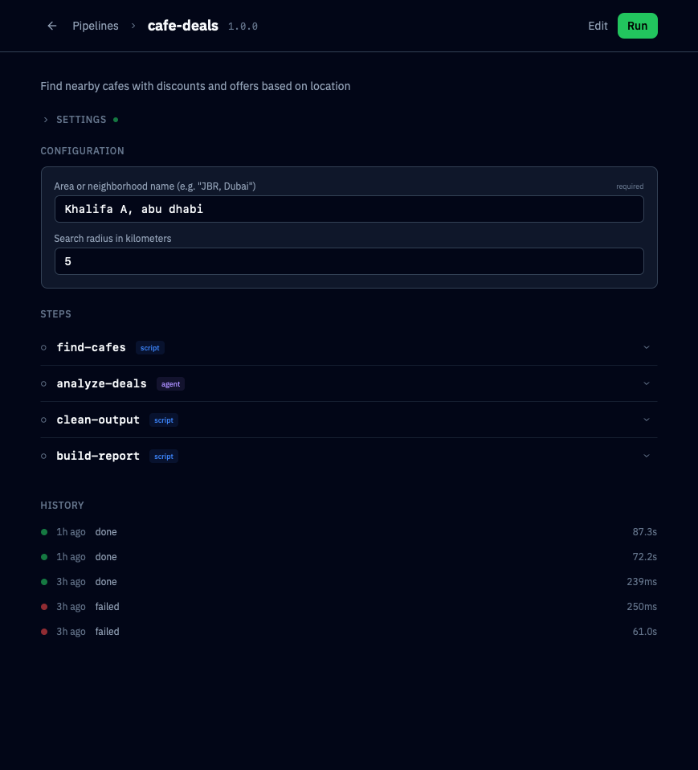

# Soul Hub

<p align="center">
  
</p>

A local-first command center for AI-human collaboration. Manage projects, orchestrate data pipelines, and build a knowledge vault — all from one interface, powered by Claude Code.


## What It Does

**Projects** — Register your dev projects, launch Claude Code sessions, browse files, and track git status from a unified dashboard.


**Pipelines** — Build multi-step data pipelines (Python, Bash, Node.js) with a visual editor. Chain pipelines together, run them on schedules, or trigger via webhooks. Agent steps run Claude Code autonomously.




**Vault** — An Obsidian-compatible knowledge graph built into the app. Pipeline outputs, session logs, and learnings are automatically captured. Browse, search, and connect notes with wikilinks.


**Builder** — A guided system for creating new pipelines and blocks. Comes with reusable components (API client, CSV tools, error handling) and templates.

## Quick Start

```bash
# Clone and install
git clone https://github.com/jneaimi/soul-hub.git
cd soul-hub
npm install

# Configure (optional — works with defaults)
cp .env.example .env
# Edit .env with your API keys

# Initialize the vault
mkdir -p ~/vault

# Run in development
npm run dev
# Open http://localhost:5173

# — OR — Run in production
npm run build
./scripts/start_prod.sh start
# Open http://localhost:2400
```

See [INSTALL.md](INSTALL.md) for detailed setup instructions.

## Requirements

- **OS**: macOS or Linux
- **Node.js**: 20+
- **Claude Code**: [Install Claude Code CLI](https://docs.anthropic.com/en/docs/claude-code)
- **uv** (optional): For Python pipeline blocks — [Install uv](https://docs.astral.sh/uv/getting-started/installation/)
- **PM2** (optional): For production deployment — included as a dev dependency

## Architecture

```
soul-hub/
├── src/                    # SvelteKit app (frontend + API)
│   ├── routes/             # Pages and API endpoints
│   ├── lib/
│   │   ├── pipeline/       # Pipeline engine (parser, runner, scheduler)
│   │   ├── vault/          # Vault engine (indexer, search, graph)
│   │   ├── pty/            # Terminal manager (node-pty sessions)
│   │   └── components/     # Svelte UI components
├── pipelines/              # User pipelines live here
│   └── _builder/           # Builder system (templates, components, docs)
├── catalog/                # Shared blocks and agents
├── static/                 # Static assets
├── server.js               # Custom Node.js server (SSE, WebSocket)
└── ecosystem.config.cjs    # PM2 production config
```

### Tech Stack

- **Frontend**: SvelteKit + Svelte 5 + Tailwind CSS v4
- **Backend**: SvelteKit API routes + custom Node.js server
- **Terminal**: node-pty + xterm.js
- **Pipeline Engine**: Custom DAG runner with chunk/loop/conditional support
- **Vault**: File-based markdown with YAML frontmatter, wikilinks, full-text search
- **Production**: PM2 process manager

## Features

### Projects
- Register any `~/dev/` folder as a managed project
- Scaffold vault zones per project (decisions, learnings, debugging, outputs)
- Git status, file browsing, and Claude Code terminal per project

### Pipelines
- **Step types**: script, agent, approval, prompt, channel, chunk, loop
- **Chains**: Orchestrate multiple pipelines as a DAG with parallel execution
- **Automation**: Cron schedules, webhook triggers, folder watching
- **Conditional execution**: `when:` and `skip_if:` on steps
- **Chunking**: Split large datasets, process in parallel, merge results
- **Config UI**: Edit pipeline config files (JSON) from the browser

### Vault
- **Knowledge graph**: Interactive node-link visualization
- **Zones**: Governed areas with allowed types and required fields
- **Auto-capture**: Pipeline outputs and terminal sessions saved automatically
- **Templates**: Structured note types (learning, decision, debugging, output)
- **Search**: Full-text search across all notes
- **Health**: Orphan detection, unresolved link tracking, reindex

### Builder
- Guided pipeline creation with discovery questions
- Reusable components (API client, CSV tools, error handling, progress)
- Templates for script blocks, agent blocks, pipelines, and chains
- Vault-aware: checks existing knowledge before building, saves learnings after

## Configuration

Soul Hub looks for `settings.json` in the project root. All settings have sensible defaults.

```json
{
  "paths": {
    "devDir": "~/dev",
    "vaultDir": "~/vault",
    "claudeBinary": "~/.claude/bin/claude"
  },
  "server": {
    "port": 2400
  },
  "terminal": {
    "fontSize": 13,
    "cols": 120,
    "rows": 40
  }
}
```

See [INSTALL.md](INSTALL.md) for all configuration options.

## API Keys

All API keys are optional. Core features (projects, vault, terminal) work without any keys. Pipeline blocks that need specific APIs will show which keys are missing.

Copy `.env.example` to `.env` and add the keys you need.

## Remote Access (Optional)

Access Soul Hub from anywhere via Cloudflare Tunnel — includes dev project preview proxy (`pXXXX.soul-hub.yourdomain.com`). See the full guide with screenshots: [docs/tunnel-guide/TUNNEL.md](docs/tunnel-guide/TUNNEL.md)

## License

MIT — see [LICENSE](LICENSE).
