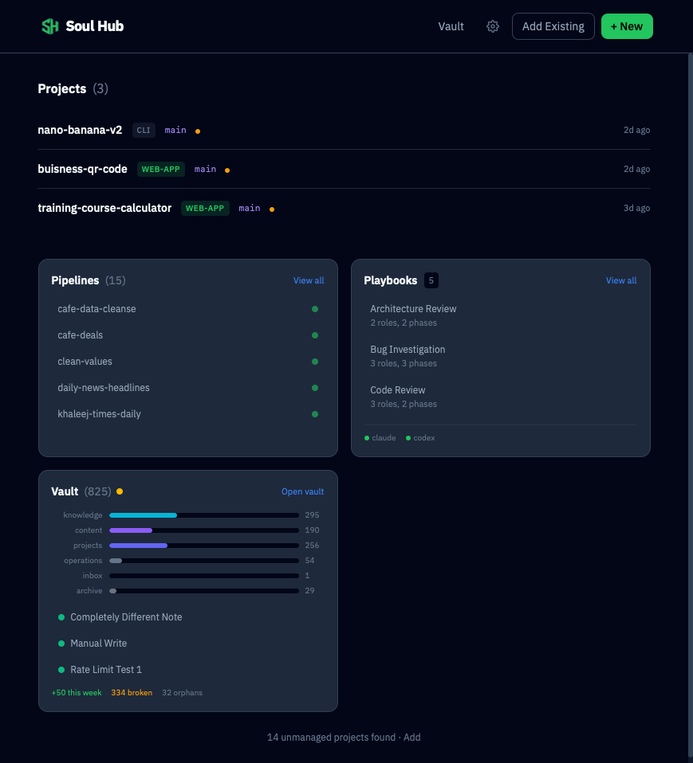
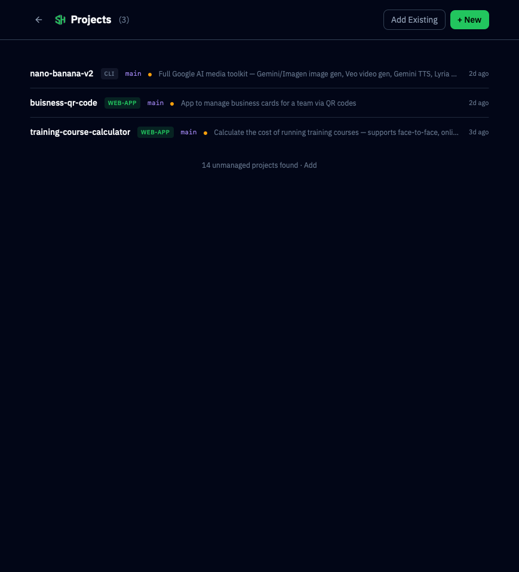
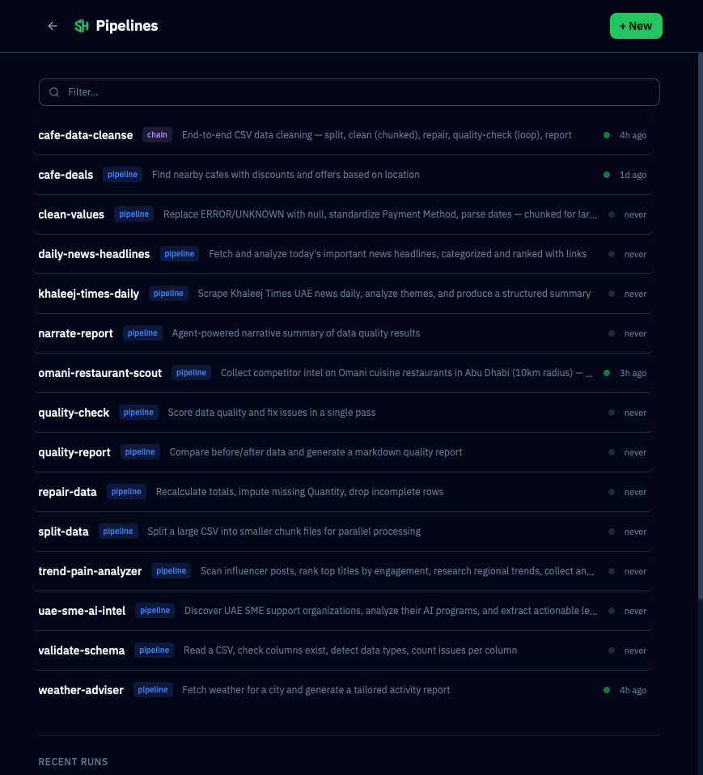
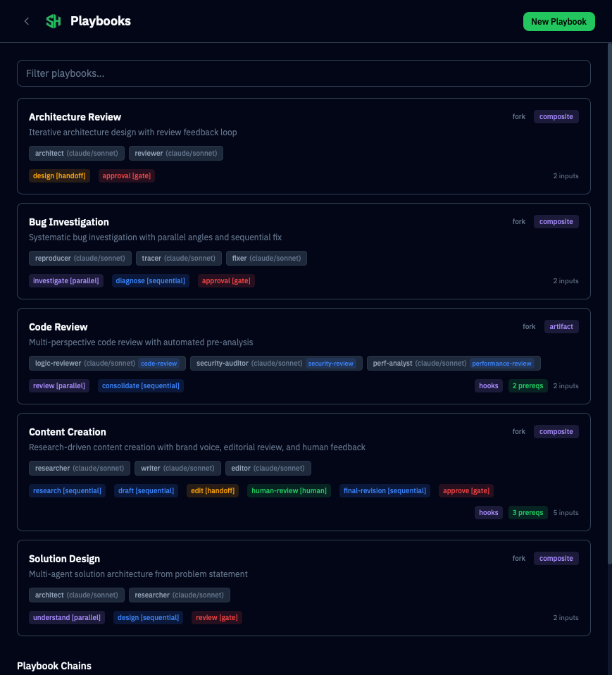
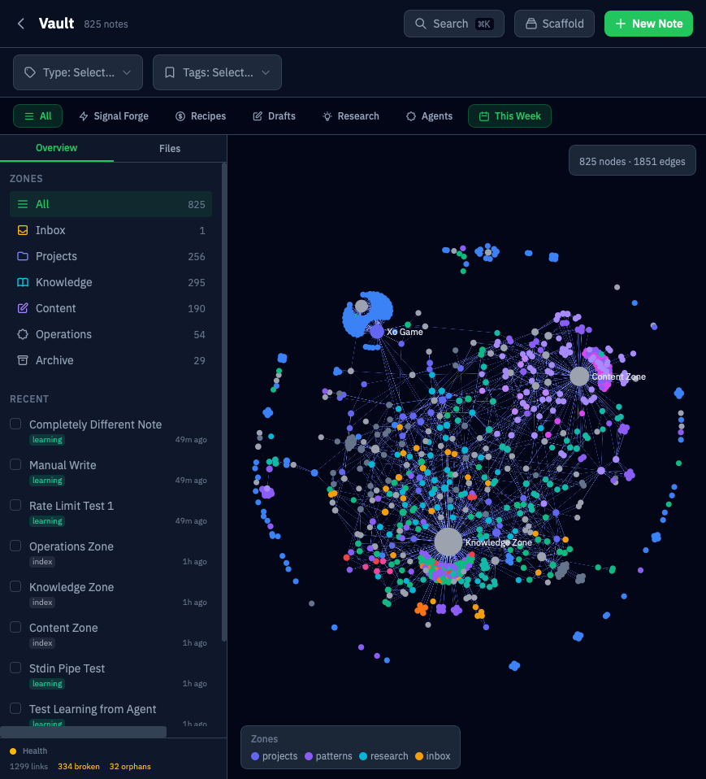

# Soul Hub

<p align="center">
  
</p>

A local-first command center for AI-human collaboration. Manage projects, orchestrate data pipelines, run multi-agent playbooks, and build a knowledge vault — all from one interface, powered by Claude Code.



## What It Does

**Projects** — Register your dev projects, launch Claude Code sessions, browse files, and track git status from a unified dashboard.



**Pipelines** — Build multi-step data pipelines (Python, Bash, Node.js) with a visual editor. Chain pipelines together, run them on schedules, or trigger via webhooks. Agent steps run Claude Code autonomously.



**Playbooks** — Multi-agent orchestration with YAML-defined roles, phases, and hooks. Run parallel code reviews, iterative architecture reviews, content creation pipelines, or bug investigations — each with specialized AI agents working together.



**Vault** — A governed, Obsidian-compatible knowledge graph with 6 zones, 60+ note types, full-text search, smart filters, and Arabic RTL support. Agent writes are rate-limited and deduplicated. Pipeline outputs and session logs are captured automatically.




**Builder** — A guided system for creating new pipelines and blocks. Comes with reusable components (API client, CSV tools, error handling) and templates.

## Quick Start

```bash
# Clone and install
git clone https://github.com/jneaimi/soul-hub.git
cd soul-hub
npm install

# Configure (optional — works with defaults)
cp .env.example .env
# Edit .env with your API keys

# Initialize the vault
mkdir -p ~/vault

# Run in development
npm run dev
# Open http://localhost:5173
```

### Production with PM2

```bash
# Build the app
npm run build

# Start with PM2 (includes Cloudflare tunnel if configured)
npm run prod:start
# Open http://localhost:2400

# Other production commands
npm run prod:restart    # Zero-downtime reload
npm run prod:status     # Show process status
npm run prod:logs       # Tail logs
npm run prod:stop       # Stop all processes
npm run prod:startup    # Enable auto-start on boot
```

The PM2 config (`ecosystem.config.cjs`) runs two processes:
- **soul-hub** — The SvelteKit app on port 2400 (512MB memory limit, auto-restart)
- **soul-hub-tunnel** — Cloudflare Tunnel for remote access (optional)

See [INSTALL.md](INSTALL.md) for detailed setup instructions.

## Requirements

| Requirement | Version | Required | Install |
|------------|---------|----------|---------|
| **Node.js** | 20+ | Yes | [nodejs.org](https://nodejs.org/) or `brew install node` |
| **Claude Code** | Latest | Yes | [docs.anthropic.com](https://docs.anthropic.com/en/docs/claude-code) |
| **uv** | Latest | For Python pipelines | [docs.astral.sh/uv](https://docs.astral.sh/uv/getting-started/installation/) |
| **PM2** | 5+ | For production | Included as dev dependency |

**Platforms**: macOS (Intel + Apple Silicon), Linux (Ubuntu 20.04+, Debian 11+)

## Architecture

```
soul-hub/
├── src/                    # SvelteKit app (frontend + API)
│   ├── routes/             # Pages and API endpoints
│   ├── lib/
│   │   ├── pipeline/       # Pipeline engine (parser, runner, scheduler)
│   │   ├── playbook/       # Playbook engine (YAML, roles, phases, hooks)
│   │   ├── vault/          # Vault engine (indexer, search, graph, governance)
│   │   ├── pty/            # Terminal manager (node-pty sessions)
│   │   └── components/     # Svelte UI components
├── pipelines/              # User pipelines live here
│   └── _builder/           # Builder system (templates, components, docs)
├── playbooks/              # Multi-agent playbook definitions
│   ├── code-review/        # Parallel 3-agent code review
│   ├── content-creation/   # Research → draft → edit → approve
│   ├── architecture-review/# Iterative architect ↔ reviewer handoff
│   ├── bug-investigation/  # Parallel reproduce + trace + fix
│   ├── solution-design/    # Research → design → gate
│   └── _templates/         # Starter templates for new playbooks
├── catalog/                # Shared blocks and agents
├── static/                 # Static assets
├── server.js               # Custom Node.js server (SSE, WebSocket)
└── ecosystem.config.cjs    # PM2 production config
```

### Tech Stack

- **Frontend**: SvelteKit + Svelte 5 + Tailwind CSS v4
- **Backend**: SvelteKit API routes + custom Node.js server
- **Terminal**: node-pty + xterm.js
- **Pipeline Engine**: Custom DAG runner with chunk/loop/conditional support
- **Playbook Engine**: YAML-defined multi-agent orchestration with phases and hooks
- **Vault**: File-based markdown with YAML frontmatter, wikilinks, full-text search (MiniSearch)
- **Production**: PM2 process manager + Cloudflare Tunnel

## Features

### Projects
- Register any `~/dev/` folder as a managed project
- Scaffold vault zones per project (decisions, learnings, debugging, outputs)
- Git status, file browsing, and Claude Code terminal per project

### Pipelines
- **Step types**: script, agent, approval, prompt, channel, chunk, loop
- **Chains**: Orchestrate multiple pipelines as a DAG with parallel execution
- **Automation**: Cron schedules, webhook triggers, folder watching
- **Conditional execution**: `when:` and `skip_if:` on steps
- **Chunking**: Split large datasets, process in parallel, merge results
- **Config UI**: Edit pipeline config files (JSON) from the browser

### Playbooks
- **YAML-defined**: Roles, phases, hooks, inputs, prerequisites, and output routing
- **Phase types**: `parallel` (independent agents), `sequential` (ordered handoff), `handoff` (iterative), `gate` (approval checkpoint), `human` (feedback loop)
- **Pre-run hooks**: Python/Bash scripts that run before agents (static analysis, signal search, brand context loading)
- **Built-in playbooks**: Code review (3 parallel reviewers), content creation (research → draft → edit → approve), architecture review (iterative), bug investigation (parallel), solution design
- **Playbook builder**: Create new playbooks from templates with guided setup
- **Multi-provider**: Claude (Opus, Sonnet, Haiku) with extensible provider registry

### Vault
- **6 zones**: inbox, projects, knowledge, content, operations, archive — each with governance rules
- **Knowledge graph**: Interactive node-link visualization with zone coloring
- **60+ note types**: learning, decision, debugging, pattern, research, draft, recipe, and more
- **Smart views**: Quick-access filter presets (Signal Forge, Recipes, Drafts, Research, Agents, This Week)
- **Multi-select filters**: Type and tag multi-select with unified command bar
- **Bulk operations**: Multi-select notes with move/archive actions
- **Arabic RTL**: Auto-detects Arabic/Hebrew content and switches to right-to-left layout
- **Agent writes**: Rate-limited (50/agent/hour), content dedup, audit trail via `GET /api/vault/writes`
- **Agent context**: `GET /api/vault/agent-context` pre-fetches relevant vault knowledge before agent tasks
- **Templates**: Structured note types with required sections and governance validation
- **Health monitoring**: Orphan detection, governance violations, unresolved link tracking

### Builder
- Guided pipeline creation with discovery questions
- Reusable components (API client, CSV tools, error handling, progress)
- Templates for script blocks, agent blocks, pipelines, and chains
- Vault-aware: checks existing knowledge before building, saves learnings after

## Configuration

Soul Hub looks for `settings.json` in the project root. All settings have sensible defaults.

```json
{
  "paths": {
    "devDir": "~/dev",
    "vaultDir": "~/vault",
    "claudeBinary": "~/.claude/bin/claude"
  },
  "server": {
    "port": 2400
  },
  "terminal": {
    "fontSize": 13,
    "cols": 120,
    "rows": 40
  }
}
```

See [INSTALL.md](INSTALL.md) for all configuration options.

## API Keys

All API keys are optional. Core features (projects, vault, terminal, playbooks) work without any keys. Pipeline blocks that need specific APIs will show which keys are missing.

Copy `.env.example` to `.env` and add the keys you need.

## Vault API

The vault exposes a REST API for programmatic access:

| Endpoint | Method | Purpose |
|----------|--------|---------|
| `/api/vault` | GET | Overview (stats, zones) |
| `/api/vault/notes` | GET | Search/list with filters |
| `/api/vault/notes` | POST | Create note (governance-validated) |
| `/api/vault/notes/[path]` | GET/PUT/DELETE | Read, update, archive note |
| `/api/vault/graph` | GET | Knowledge graph (nodes + edges) |
| `/api/vault/writes` | GET | Agent write audit trail |
| `/api/vault/agent-context` | GET | Pre-fetch context for agent tasks |
| `/api/vault/health` | GET | Vault health report |
| `/api/vault/tags` | GET | Tag taxonomy with counts |
| `/api/vault/reindex` | POST | Force full reindex |

Agents can use the shell tools `vault-context.sh` (read) and `vault-save.sh` (write) for convenience.

## Remote Access (Optional)

Access Soul Hub from anywhere via Cloudflare Tunnel — includes dev project preview proxy (`pXXXX.soul-hub.yourdomain.com`). See the full guide with screenshots: [docs/tunnel-guide/TUNNEL.md](docs/tunnel-guide/TUNNEL.md)

## License

MIT — see [LICENSE](LICENSE).
